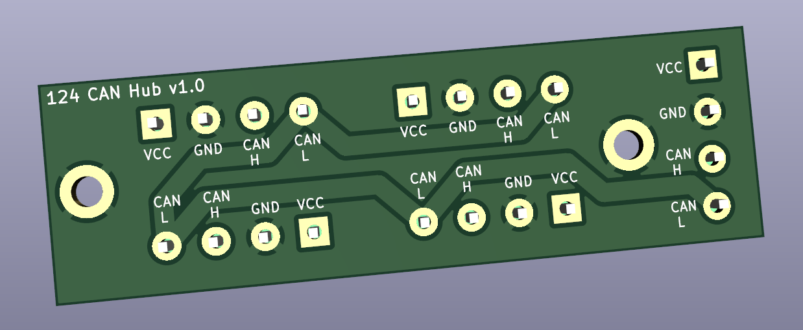

1 to 4 CAN Hub
==============
The CAN hub is designed to expand the number of CAN devices without needing to make custom wiring loom. 

BOM
---
5x Therminal Block P5.08 4 Rows.

Manufacturing
-------------
BOM (with LCSC part number) and gerber files are provided under [production](production) directory. 

Revisions
* v1.0: Initial release.